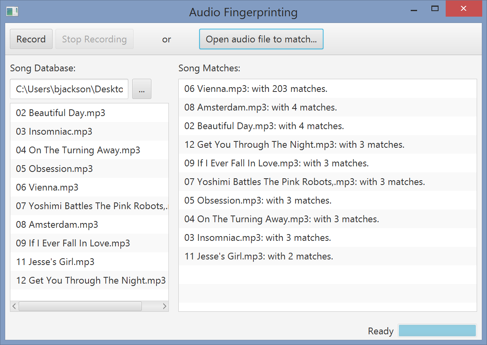

COMP 124 HW 7:  Audio Fingerprinting!
==========================

For this homework assignment, you will implement an audio recognition program that is similar in style to the Shazam app.
The application works by first analyzing a directory of songs and creating digital fingerprints(e.g. a hash code)for each one. These fingerprints are
stored in a map to allow fast lookups. Once the map is created, your application will allow you to either load a song clip or listen
with your computer's microphone. The recorded sounds will be fingerprinted and compared to existing songs in the map to identify the
song that was played.

Your finished program will look like:

To get started, read and study the following description of the algorithm you will implement: [Shazam It! Music Recognition Algorithms, Fingerprinting, and Processing](http://www.toptal.com/algorithms/shazam-it-music-processing-fingerprinting-and-recognition)

### Getting Setup
You many work on this assignment with a partner. You and your partner should work using the pair programming model, where both of you are 
sitting at a single machine, side by side. (You may not split up the assignment and work on different parts separately! That defeats the 
whole purpose of having a partner.) One of you will be "driving," i.e., actually using the keyboard and mouse. The other one of you will 
be actively engaged (navigating, if you will): following along, providing ideas, catching and preventing bugs, etc. 
You should make sure that over the course of an assignment that you spend roughly the same amount of time each "driving."

Fork and clone this repo. You only need one fork per pair of partners. I have included some code to display a user interface and get you started. You will also need to
organize some music files to test. Create a new directory somewhere on your hard drive and copy several mp3 files (with extension ".mp3") into the directory.
These files will serve as your database possible songs to match against.

### Getting to know the existing code
Read through the existing code and make sure you understand how the different classes and methods work together. In particular,
there are two classes you will work closely with:

`SongDatabase` represents the database of songs that you will match against. It contains methods for reading in the audio data and converting it to the frequency domain using the fast fourier transform.

`AudioFingerprinter` is an interface that you will need to implement in your own class. It specifies the method decomposition needed to fingerprint and recognize a song.

Before you continue, you should answer the following questions:

* What is the purpose of the `DataPoint` class and its relationship to the `matcherDB` instance variable in the `SongDatabase` class?
* Why does the `matcherDB` object contain a List of DataPoints as the value rather than a single DataPoint?
* The `convertToFrequencyDomain` method returns a 2D array of doubles (see section 11.6 in the Roberts textbook for examples of how to use 2D arrays). How is the data in this array organized?
* How do we take into account timing information when determining matches? 

### Task 1: 

Create a new Java class that implements the `AudioFingerprinter` interface. Your class will likely need to take a `SongDatabase` object 
as a parameter to the constructor to initialize an instance variable. Look carefully at the javadoc comments in the interface 
to make sure you are implementing each method correctly.

You may make use of the code provided in the [Shazam It!](http://www.toptal.com/algorithms/shazam-it-music-processing-fingerprinting-and-recognition)
article to determine the key points and hash function.

### Task 2:

Complete the `processFile` method in the `SongDatabase` class. This method is used to analyze each song to create a database of fingerprints.

### Task 3:

Test your code using the `SimpleFingerprinter` class. You will need to modify the paths to the directory of songs you created in the setup and 
the specific song you want to match. You will also need to initialize the `AudioFingerprinter rec` variable to an instance of your implementing class.

Once `SimpleFingerprinter` is working, complete the TODO comment in the MainApp class. You should now be able to run the MainApp.

### Submission:

If you worked with a partner, I need to know so that I can give you credit. Please right-click the 124-hw7 module in Intellij.
Select new->file and enter the name as "partner-assignment.txt". In the text document add both of your names. Make sure the file is added to git (it should show up in green)!

Make sure to commit and push, then check on github that everything is uploaded correctly.

As always, please make sure to follow the guidelines for [good java style](https://docs.google.com/document/d/1V8BM38WXnBuVvTPilZMVCSuITLVW5VEfPKHaJ3uCZgc/edit?usp=sharing) that we have shared with you in the past.

